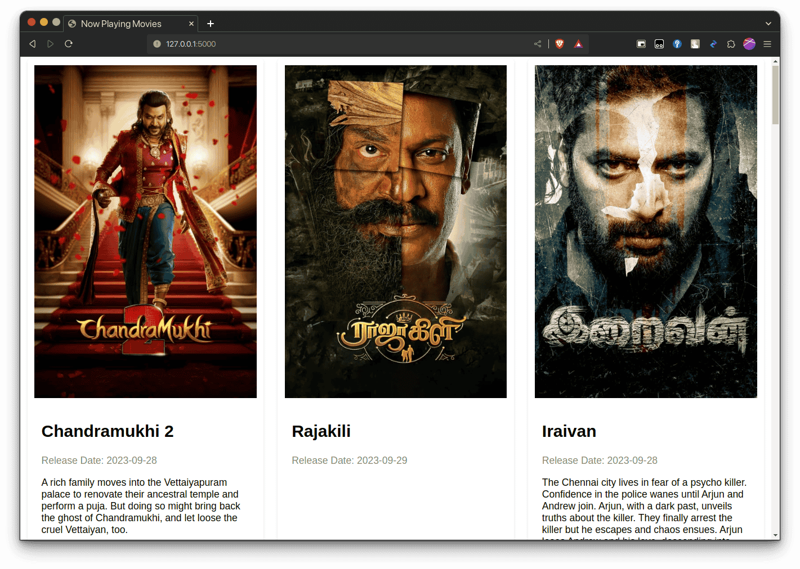

# Movie Radar
A Flask web application that displays latest now playing movies based on language. 

This application uses the free [TMDB](https://www.themoviedb.org) (The Movie Database) API.

## Screenshots



## Getting Started

1. Install the required Python packages:

```bash
pip install -r requirements.txt
```
2. Get api from [TMDB](https://www.themoviedb.org) and set 'API_KEY' in the app.py file.

3. Run the app.py

```
python app.py
```

4. Access the application in your web browser at http://localhost:5000/
